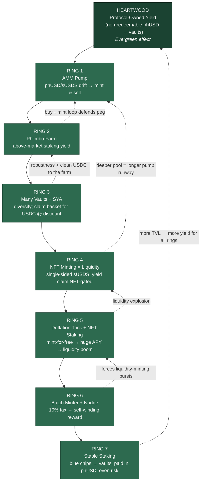
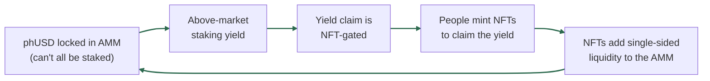

# Phoenix Protocol — Ring Dependency Diagram

*Companion to [`phoenix-protocol-explained.md`](./phoenix-protocol-explained.md) and [`phoenix-protocol-deck-and-script.md`](./phoenix-protocol-deck-and-script.md).*

Three views of the same structure:
1. **Concentric rings** (ASCII) — the "one organism, grown outward" picture. Best for print/terminal and as a slide background.
2. **Dependency graph** (Mermaid) — "made possible by" vs. "strengthens" arrows. Best for showing the *circular* funding loop.
3. **The funding loop, isolated** (Mermaid) — the single sentence "the AMM funds the liquidity that funds the AMM," drawn.

---

## View 1 — Concentric Rings (ASCII, one-page)

```
                  ┌─────────────────────────────────────────────────────────┐
                  │  RING 7 · STABLE STAKING                                  │
                  │  Stake USDC / USDe / DOLA → vaults; paid in minted phUSD  │
                  │  → raw TVL, fast · even $/vault → risk spread → SAFER     │
                  │   ┌───────────────────────────────────────────────────┐  │
                  │   │  RING 6 · BATCH MINTER + NUDGE                     │  │
                  │   │  10% batch tax → self-winding reward → forced      │  │
                  │   │  bursts of liquidity minting                       │  │
                  │   │   ┌─────────────────────────────────────────────┐ │  │
                  │   │   │  RING 5 · DEFLATION TRICK + NFT STAKING      │ │  │
                  │   │   │  NFT mint deflates phUSD → mint a little     │ │  │
                  │   │   │  for free → huge NFT-staking APY →           │ │  │
                  │   │   │  LIQUIDITY EXPLOSION                         │ │  │
                  │   │   │   ┌───────────────────────────────────────┐ │ │  │
                  │   │   │   │  RING 4 · NFT MINTING = LIQUIDITY      │ │ │  │
                  │   │   │   │  USDS → single-sided sUSDS join;       │ │ │  │
                  │   │   │   │  yield claim GATED by burning an NFT   │ │ │  │
                  │   │   │   │   ┌─────────────────────────────────┐ │ │ │  │
                  │   │   │   │   │  RING 3 · MANY VAULTS + SYA     │ │ │ │  │
                  │   │   │   │   │  diversify yield; claim basket  │ │ │ │  │
                  │   │   │   │   │  for USDC at a discount         │ │ │ │  │
                  │   │   │   │   │   ┌───────────────────────────┐ │ │ │ │  │
                  │   │   │   │   │   │ RING 2 · PHLIMBO FARM     │ │ │ │ │  │
                  │   │   │   │   │   │ stake phUSD; <100% can →  │ │ │ │ │  │
                  │   │   │   │   │   │ ABOVE-MARKET yield        │ │ │ │ │  │
                  │   │   │   │   │   │  ┌─────────────────────┐  │ │ │ │ │  │
                  │   │   │   │   │   │  │ RING 1 · AMM PUMP   │  │ │ │ │ │  │
                  │   │   │   │   │   │  │ phUSD/sUSDS drift   │  │ │ │ │ │  │
                  │   │   │   │   │   │  │ >$1 → mint & sell   │  │ │ │ │ │  │
                  │   │   │   │   │   │  │ → TVL + liquidity   │  │ │ │ │ │  │
                  │   │   │   │   │   │  │  ┌───────────────┐  │  │ │ │ │ │  │
                  │   │   │   │   │   │  │  │  HEARTWOOD    │  │  │ │ │ │ │  │
                  │   │   │   │   │   │  │  │ PROTOCOL-     │  │  │ │ │ │ │  │
                  │   │   │   │   │   │  │  │ OWNED YIELD   │  │  │ │ │ │ │  │
                  │   │   │   │   │   │  │  │ (phUSD, non-  │  │  │ │ │ │ │  │
                  │   │   │   │   │   │  │  │ redeemable)   │  │  │ │ │ │ │  │
                  │   │   │   │   │   │  │  │ → EVERGREEN   │  │  │ │ │ │ │  │
                  │   │   │   │   │   │  │  └───────────────┘  │  │ │ │ │ │  │
                  │   │   │   │   │   │  └─────────────────────┘  │ │ │ │ │  │
                  │   │   │   │   │   └───────────────────────────┘ │ │ │ │  │
                  │   │   │   │   └─────────────────────────────────┘ │ │ │  │
                  │   │   │   └───────────────────────────────────────┘ │ │  │
                  │   │   └─────────────────────────────────────────────┘ │  │
                  │   └───────────────────────────────────────────────────┘  │
                  └─────────────────────────────────────────────────────────┘

      Outward  ►  each ring is UNLOCKED by the ring inside it
      Inward   ◄  each ring FEEDS BACK to strengthen the rings within
```

---

## View 2 — Dependency Graph (Mermaid)

> Renders on GitHub, in VS Code with a Mermaid extension, and in most slide tools that accept Mermaid.
> **Solid arrows = "is made possible by."** **Dashed arrows = "feeds back / strengthens."**



---

## View 3 — The Funding Loop, Isolated (Mermaid)

> The single most important idea to land in a talk: **"the AMM funds the liquidity that funds the AMM."** This is that sentence, drawn as a closed loop.



**How to narrate it:** start anywhere and go all the way around. "Locked phUSD makes yield above-market → the yield is gated behind an NFT → so people mint NFTs to claim it → minting an NFT deepens the AMM → a deeper AMM locks more phUSD." The loop closes. Each turn enlarges the next.

---

## Caption / one-liner for the diagram

> *Phoenix isn't a stack of features — it's a set of rings. Each ring is unlocked by the one inside it and pays value back to the ones beneath it. The result is one organism: antifragile at the core, self-funding in the middle, self-accelerating at the edge.*
